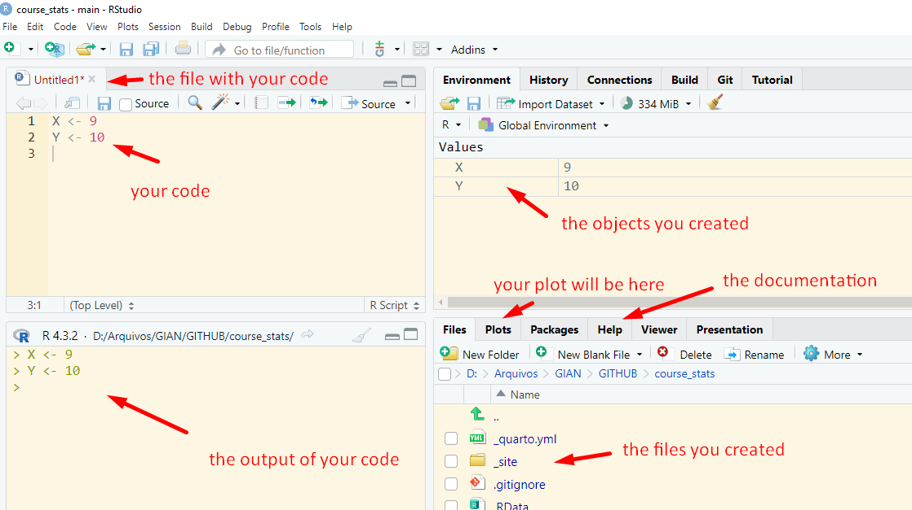

::: callout-important
Below, we provide a clear and straightforward explanation of the R language for those unfamiliar with this domain. Complex terms and technical specifics that might confuse beginners have been simplified to make the content more accessible.
:::

#### Download R and RStudio

First, you'll need to have two essential components installed on your computer: the R language itself and a software environment to interpret it, with RStudio being the most commonly used option.

#### Stay on track!

In R you write your own script or code. You cannot simply click buttons and get many reports as in JMP. It is time consuming, but you also have more personalized and specific results. Below we see the four main panels of RStudio. The only difference with yours is probably that I changed the theme of my RStudio. That's why it's yellow :)



Explaining in an easy way, **programming is similar to mathematics**. For example, if you know that $X = 9$ and you need to calculate $X + 3$, you know that the result is 12 because you sum $9 + 3$. In this case you *attributed* or *assigned* 9 to $X$. You can do that in R like this:

```{r}
X <- 9
```

```{r}
X + 3
```

::: callout-tip
On the same line of your code, select Ctrl + Enter, so you don't have to click Run all the time. If you want to run more than one line at once, select the lines and then Ctrl + Enter.
:::

Now, `X` is a numerical object with the value 9.

You can put this result in another object, for example, called `result`.

```{r}
result <- X + 3
result
```

Then you decided that `X` should be 10, so you simply change `X` and run `result` again.

```{r}
X <-  10 
result <- X + 3 
result
```

#### Commenting your code

Before going into deeper subjects, one basic thing (but very important to learn) is the act of commenting the code. It's common to forget what the code represents, so we can write inside the code so we remember what was done.

```{r}
# this is a comment 
# a commented line always starts with # 
# a comment helps you remember what your code does
# on the next line, I attributed X = 9
X <- 9
# everything you write after # will not work as a code
```

Below we have a comment and not an actual code. It will be interpreted by the software as a comment.

```{r}
# Y <- 9
```

If you then try to run `Y + 3`, you will get the message **Error: object 'Y' not found** because `Y` was not created.

You can choose to comment one line before the code, one line after the code or on the same line of the code.

```{r}
# comment before
X <- 9 # comment on the same line
# comment after 
```

#### Different categories

Most of the time, your objects will typically fall into one of three categories:

**Numeric**: Represents numbers.

**Character**: Represents text, such as words, sentences, or individual letters.

**Logical**: Represents Boolean values, such as TRUE or FALSE.

```{r}
# numerical
X <- 9
# character
X <- "I love you"
# logical
X <- FALSE
X <- TRUE
```

#### Structures

For this course, we will mostly use tables similar to Excel tables (data sets), called tecnically in R as data frames. As explained [in this online book](https://bookdown.org/ansellbr/WEHI_tidyR_course_book/week3.html), we should **always** keep in mind the structure of a data set.


-   each column represents a single measurement type

-   each row represents a single observation

-   each cell contains a single value

#### Functions

To perform calculations or actions on your data, you can use specific functions in R. For example, to sum numbers, use `sum()`. To calculate logarithms, use `log()`. And to create visualizations, use `plot()`. It's as straightforward as that---these functions help you easily manipulate and analyze your data.

```{r}
x <- c(9,3,10,1245)
sum(x) # it sums the vector
log(x) # it calculates the log of each number 
plot(x) # it plots the numbers, first number (1) is 9, second number (2) is 3 and so on.
```

#### Arguments

Inside the functions there are arguments, which help control and personalize

```{r}

```

?sum
